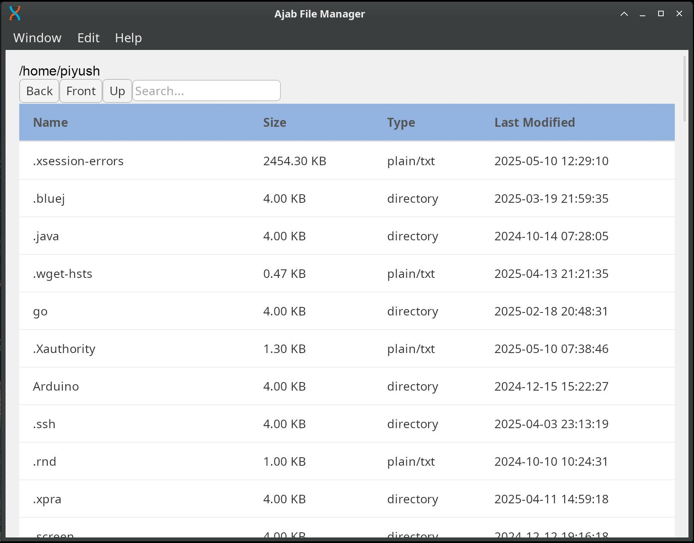
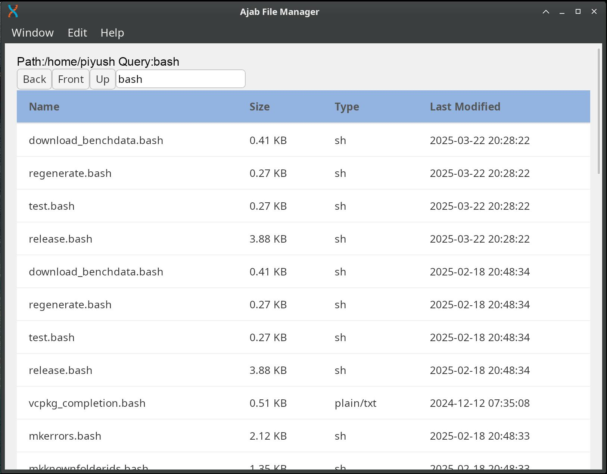

# Ajab File Manager

A toy file manager. It includes very basic features.

## How to Run

- To run this you will need [Rust](https://www.rust-lang.org/) and [Dioxus CLI and dependencies](https://dioxuslabs.com/learn/0.6/getting_started/)

  > Install all dependencies mentioned in the Dioxus documentation.

- Once done, clone the project and go to the root directory of the project. The following command will start the app:

```bash
dx serve
```

## Why I Chose Dioxus

Before starting the project, I had multiple options. After experimenting a little with all, I finally settled on Dioxus. The reasons are as follows:

- **Slint:** It is a good framework, but it has its own language to write the UI. This is not a good idea as I didn't have much time to learn.
- **Iced:** This framework is well-known and is used by many. It is simple to work with but lacks support for context menus. [https://github.com/iced-rs/iced/issues/114](https://github.com/iced-rs/iced/issues/114)
- **egui:** This is also good but more suited for making games. Creating layouts is less intuitive, and the GUI is focused on `immediate mode`, which has its own issues. It can affect threads if not done correctly.
- **Yew:** This is a great option. There aren't any issue that bothered me, and integrations are also good. But I just didn’t try it this time — I need more time to explore.
- **Tauri:** Tauri is fast and well-organized, but it has more moving parts. I will give it a try again. We can use Dioxus and Yew in Tauri.
- **Dioxus:** It is simple with a very low learning curve. It's fast and well-maintained. While it looks like a good option, it has its own problems. The `StreamingJson` response is broken on the web. Not sure how to fix it. There must be some workaround.

## Screenshots



