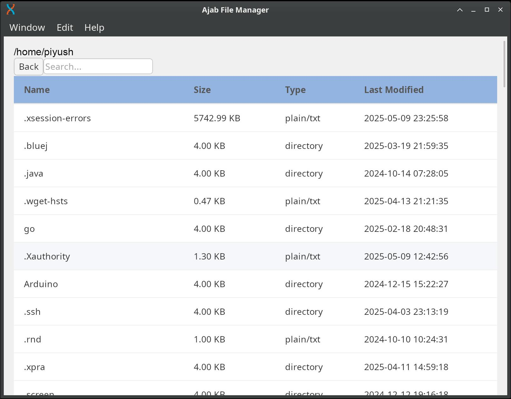
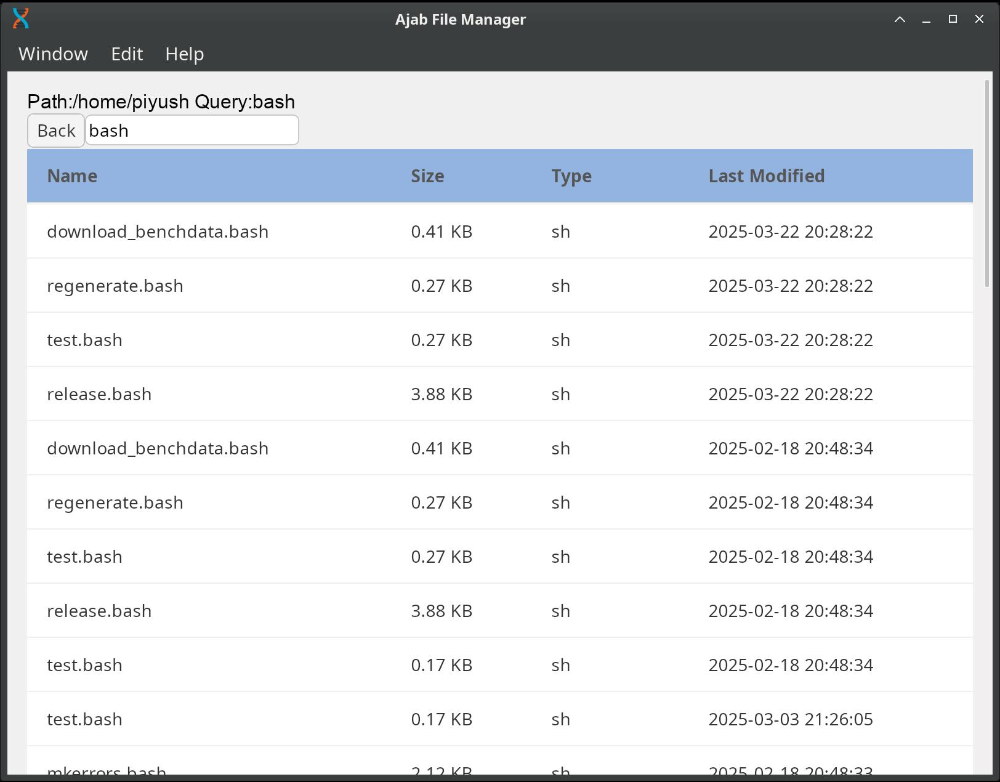

# Ajab file manager

A toy file manager. It includes very basic features

## How to run

- To run this you will need [rust](https://www.rust-lang.org/) and [dioxus cli and dependencies](https://dioxuslabs.com/learn/0.6/getting_started/)
  > Install all dependencies mentioned in dioxus doc
- Once done clone the project and go to root directory of the project. The followin command will start server

```bash
dx serve

```

## I choose Dioxus

Before starting the project I had multiple options. After experimenting little with all finally settled to dioxus. The reasons are all follows:

- **Slint:** It is a good framework. But it had its own langage to write ui. This is to a good idea as I didn't have much time to learn.
- **Iced:** This framework ia well known and is used my many. It is simple to work with but lack support context menu. https://github.com/iced-rs/iced/issues/114
- **egui:** This is also good but for making games. Making layout is less intutive and also the gui is focused on `immediate mode` gui which has its own issues. It can affec thread if not done correctly.
- **Yew:** This is great option. There is not much issues. and integrations are also good. But I just didn't try it this time. Need more time to explore
- **Tauri:** Tauri is fast and well organised. But it has more moving parts. I will give it a try again. We can use dioux and yew in tauri.
- **Dioxus:** It is simple with very learning curve. It fast and well maintained

## Screenshots



